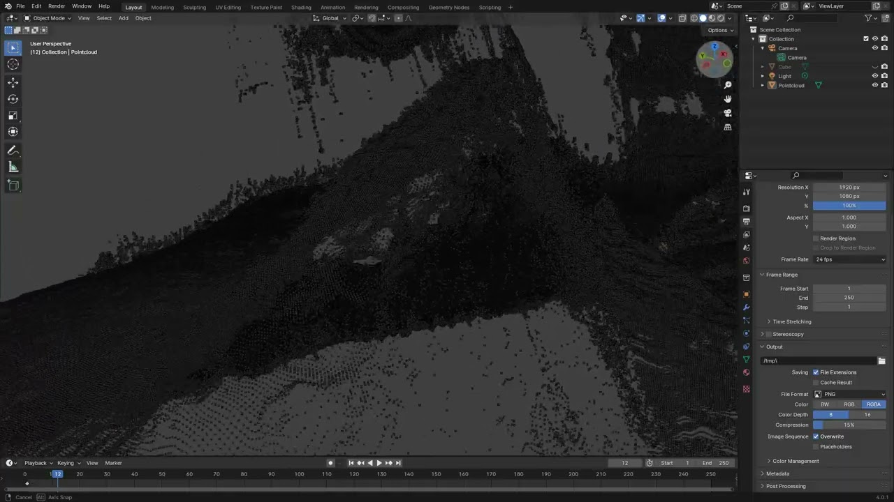

# Bolts
Based on ZED Stereo Camera

## Introduction

## System Configuration


<p align="center">
 Figure 1. ZED stereo vision camera
</p>


<p align="center">
 Figure 2. WeGo-ST MINI based on ROS
</p>

## Experiments

### Overview of 3D Point Cloud Data Obtained from the ZED Stereo Vision Camera

[](https://www.youtube.com/watch?v=R5_7TohjqF8)

<p align="center">
 Figure 3. Overview of 3D point cloud data obtained from the ZED stereo vision camera
</p>

## Codes

### Calculate the Distance between Two 3D Points from .SVO File

To run the program, use the following command in your terminal:

```bash
python get_distance.py --input_svo_file <input_svo_file> --p1 100,100 --p2 200,200 --frame_rate 100
```

Arguments:
* --input_svo_file: Path to the existing .svo file
* --p1: First pixel coordinates in the left 2D image (ex. (100, 100))
* --p2: Second pixel coordinates in the left 2D image (ex. (200, 200))
* --frame_rate: Frame rate for the SVO file to be referenced (ex. 100 frame rate)

### Mapping between the 2D left image and distances calculated from point cloud acquired from ZED camera

To run the program, use the following command in your terminal:

```bash
python map_distance_2d.py --input_svo_file <input_svo_file> --input_boundaries_file <input_boundaries_file> --input_bolts_file <input_bolts_file> --frame_rate 100 --output_path <output_path> --width 2000 --height 2000
```

Arguments:
* --input_svo_file: Path to the existing .svo file
* --input_boundaries_file: A CSV file with pre-calculated coordinates for the two intersections with the bolt holes on the shortest path between the bolt holes.
* --input_bolts_file: A CSV file with the coordinates and radius of the center point of the pre-sorted bolt holes.
* --frame_rate: Frame rate for the SVO file to be referenced (ex. 100 frame rate)
* --output_path: Path to the image and CSV file for the mapped results
* --width: Specify the width of the left image (ex. 2000px)
* --height: Specify the height of the left image (ex. 2000px)

## Results


<p align="center">
 Figure 4. The result of mapping between the 2D left image and distances calculated from point cloud acquired from ZED camera
</p>